Базовая настройка фаервола в Микротик
```

Содержание
[Введение](https://github.com/leks0d/cheat_sheet/blob/main/mikrotik/firewall_base_setup.md#%D0%B2%D0%B2%D0%B5%D0%B4%D0%B5%D0%BD%D0%B8%D0%B5)
Default firewall в Mikrotik
Firewall и базовая настройка безопасности
Safe Mode
Порядок расположения правил в Firewall
Цепочки правил
Примеры готовых правил
Настройка NAT в микротик
Проброс портов
Защита подключения через winbox
Fasttrack
Как на микротике отключить файрвол
Заключение
Помогла статья? Подписывайся на telegram канал автора
Данная статья является частью единого цикла статьей про Mikrotik.

```
## <a id="header" />Введение

Итак, будем считать, что вы уже настроили роутер примерно так же, как я описал в своей статье. Есть локальная сеть, которая будет выходить в интернет через микротик. И есть сам микротик, который хочется защитить, ограничив доступ для всего лишнего, разрешив только то, что нам нужно.

192.168.88.1	локальный адрес микротика
bridge1-lan	название бриджа, в который объединены все интерфейсы для локальной сети
ether1-wan	интерфейс для внешнего подключения WAN
192.168.88.0/24	локальная сеть, которую обслуживает микротик
Default firewall в Mikrotik
Если вы используете дефолтную конфигурацию роутера, то она по-умолчанию имеет стандартные правила firewall. Привожу список стандартных правил (rules) с комментариями. Напоминаю, что экспорт правил firewall в mikrotik можно выполнить следующей командой:

```
/ip firewall export file=rules
```
Вот список стандартных правил:
```
/ip firewall filter
add action=accept chain=input comment="defconf: accept established,related,untracked" connection-state=established,related,untracked
add action=drop chain=input comment="defconf: drop invalid" connection-state=invalid
add action=accept chain=input comment="defconf: accept ICMP" protocol=icmp
add action=drop chain=input comment="defconf: drop all not coming from LAN" in-interface-list=!LAN
add action=accept chain=forward comment="defconf: accept in ipsec policy" ipsec-policy=in,ipsec
add action=accept chain=forward comment="defconf: accept out ipsec policy" ipsec-policy=out,ipsec
add action=fasttrack-connection chain=forward comment="defconf: fasttrack" connection-state=established,related
add action=accept chain=forward comment="defconf: accept established,related, untracked" connection-state=established,related,untracked
add action=drop chain=forward comment="defconf: drop invalid" connection-state=invalid
add action=drop chain=forward comment="defconf:  drop all from WAN not DSTNATed" connection-nat-state=!dstnat connection-state=new in-interface-list=WAN
/ip firewall nat
add action=masquerade chain=srcnat comment="defconf: masquerade" ipsec-policy=out,none out-interface-list=WAN
```
В принципе, по приведенным комментариям примерно понятно, что тут происходит. Дропаются все входящие и транзитные соединения не из локальной сети, разрешен пинг - icmp, разрешен ipsec, разрешены установленные соединения. Все. Ну и настроен NAT через WAN интерфейс.

Во многих случаях данных правил по-умолчанию может быть достаточно обычному пользователю, который просто настроил маршрутизатор дома для выхода в интернет. Берите на вооружение, если вам от маршрутизатора больше ничего не надо.

Если же вы хотите получше разобраться в устройстве firewall и попробовать настроить его самостоятельно, то давайте разбираться дальше вместе.

Firewall и базовая настройка безопасности

Давайте теперь немного порассуждаем, зачем нужен файрвол и какие вопросы он решает. Причем не только в контексте микротика, а вообще. Сейчас каждый доморощенный админ рассказывает, как важно всегда настраивать firewall, иногда даже не понимая, для чего он нужен. Лично я не сторонник создания лишних сущностей, поэтому там где межсетевой экран не нужен, я его не настраиваю.

Сетевой экран позволяет настраивать доступ как к самому шлюзу, так и к ресурсам за ним. Допустим, у вас не запущено никаких сервисов на роутере, и нет никакого доступа извне в локальную сеть. У вас есть какая-то служба на шлюзе, с помощью которой к нему подключаются и управляют (ssh, winbox, http и т.д.), причем ограничение доступа к этой службе настраивать не планируется. Вопрос - зачем вам в таком случае настраивать фаервол? Что он будет ограничивать и какие правила туда писать? В таком случае вам будет достаточно отключить все сервисы на роутере, которые слушают подключения из вне и все.

На самом деле такой кейс очень популярный дома или в мелких организациях, где нет постоянного админа. Просто настроен какой-то роутер, поднят NAT и все. Я понимаю, что не правильно не настраивать ограничения на доступ к управлению, но я рассказываю, как часто бывает. То есть firewall должен решать конкретную задачу по ограничению доступа к ресурсам, а не существовать просто так, чтобы был.

Еще популярны случаи, когда настроена куча правил, а в конце все равно стоит accept для всех подключений. Такие ляпы я сам иногда делал, когда отлаживал где-то работу сервиса и забывал потом вернуть обратно ограничения. Фаервол вроде настроен, но реально его нет. Если отключить - ничего не изменится.

К чему я все это написал? К тому, что прежде чем настраивать firewall, надо определиться с тем, для чего мы это делаем. Какие разрешения или ограничения и для кого мы будем вводить. После этого можно переходить к настройке.

В своем примере я буду настраивать межсетевой экран на микротике, находясь в локальной сети. Вам всегда советую поступать так же. Есть старая админская примета - удаленная настройка файрвола к дальнему пути.
Safe Mode
У Mikrotik есть интересное средство в виде Safe Mode, которое позволяет относительно безопасно настраивать Firewall удаленно. Суть его очень простая. Вы включаете этот режим через соответствующую настройку.

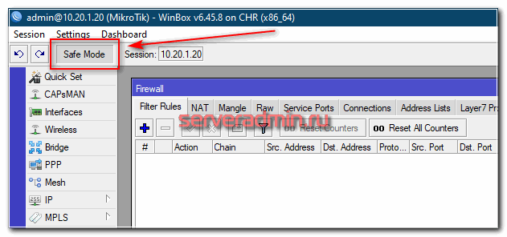

Далее, если вы некорректно выйдете из этого режима, то все созданные вами настройки будут отменены. Корректным выходом из режима является ручное его отключение через ту же настройку. Таким образом, если во время настройки фаервола у вас пропала связь из-за неверного правила или по какой-то другой причине, Микротик откатит обратно сделанные вами изменения и вы сможете снова подключиться к роутеру.

В терминале этот режим включается комбинацией клавиш CTRL+X. Время ожидания, перед откатом изменений максимум 9 минут (время TCP timeout). Подробнее об этом режиме можно почитать в официальной документации.

Порядок расположения правил в Firewall
Перед началом настройки firewall в mikrotik, отдельно остановлюсь на одном очень важном моменте - порядке расположения правил. Многие, да и я сам ранее, не придавал большого значения этому, так как не сталкивался с высокими нагрузками на сетевое оборудование. Если нагрузки нет, то разницу не замечаешь. Тем не менее, лучше ее понимать.

Пакеты проходят по списку правил по порядку, сверху вниз. Если пакет соответствует какому-то правилу, то он прекращает движение по цепочке. Из этого следует важный вывод - первыми в цепочке должны быть правила, которые охватывают максимальный объем трафика, чтобы он дальше не обрабатывался устройством. Примером такого правила является разрешение пакетов уже установленных (established) или связанных (related) соединений, которые ранее были разрешены каким-то правилом. Повторно проверять по всем правилам их не нужно. Сделаем такое правило для цепочки input - входящие соединения роутера.

Я сначала приведу это правило в виде команды для терминала, который вы можете открыть через winbox. Введите это правило через консоль, а потом уже изучите через визуальное представление. Переходим в соответствующий раздел IP -> Firewall и добавляем правило. Рекомендую всегда ставить комментарии для правил. Так их проще анализировать.
```
/ip firewall filter
add action=accept chain=input comment="accept establish & related" connection-state=established,related
```
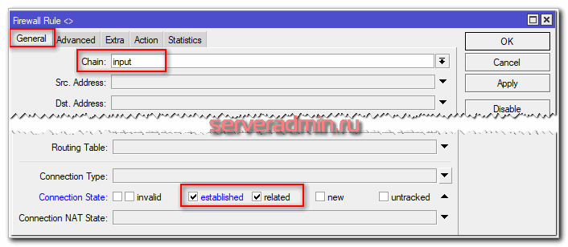

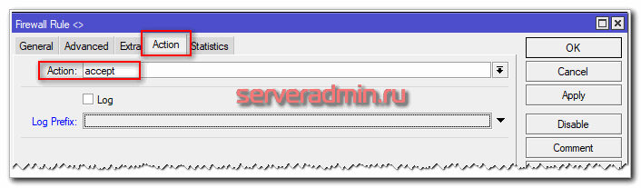

В дефолтном правиле фаервола сюда же добавлены untracked подключения. Я не стал их добавлять, так как обычно не использую данную возможность. Untracked - это пакеты, не отслеживаемые connection tracker. То есть идущие мимо многих функций фаервола. В конце статьи я отдельно расскажу об этой возможности.

Цепочки правил
Первое правило фаервола для цепочки input мы уже написали, но при этом я забыл немного рассказать о существующих цепочках правил в микротиковском фаерволе. Они наследуются из линуксового фаервола iptables. По сути, в mikrotik работает именно он.

Input - пакеты, отправленные на сам роутер. Если вы подключаетесь к нему по ssh или winbox, пакеты попадают как раз в эту цепочку.
Forward - транзитные пакеты, идущие через маршрутизатор. Например, в локальную сеть за ним, или из нее. Все запросы в интернет через маршрутизатор микротик будут попадать в цепочку forward.
Output - пакеты, отправленные с маршрутизатора. Например, микротик синхронизирует время с внешними ntp серверами. Эти запросы будут попадать в цепочку output.
При составлении правил firewall нет смысла пытаться как-то перемешивать правила из разных цепочек. Они все равно будут читаться по порядку в соответствии с той цепочкой, в которую попадает пакет. Поэтому я обычно сначала описываю все правила для input, потом для forward и в конце, в случае необходимости, для output.

Примеры готовых правил
Двигаемся дальше. Одно правило у нас есть, рисуем следующее. Отбрасываем все неверные (Invalid) пакеты. Это чистой воды паразитный трафик. Его пакеты не являются частью ни одного из отслеживаемых соединений. Поэтому чем раньше мы их отбросим, тем меньше они будут нагружать дальше фаервол проверками.
```
/ip firewall filter
add action=drop chain=input comment="drop invalid" connection-state=invalid
```
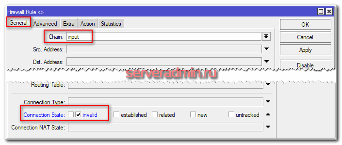

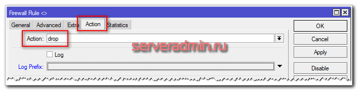

Дальше не буду приводить скрины, очень хлопотно их под каждое правило делать, да и нет смысла. Просто вставляйте через консоль правила и изучайте их сами в winbox. Разрешаем icmp трафик, чтобы можно было пинговать роутер.
```
/ip firewall filter
add action=accept chain=input comment="accept ICMP" protocol=icmp
```
Соответственно, если хотите его заблокировать, то вместо action=accept сделайте drop, или просто не пишите правило, если в конце у вас будет полная блокировка всего, что не разрешено явно.

Дальше я обычно разрешаю подключаться к портам, отвечающим за управление роутером (ssh, winbox, https) с доверенных ip адресов. Подробно этот вопрос я рассмотрю отдельно ниже, поэтому пока это правило пропустим.

Создаем заключительное правило для цепочки input, которое будет блокировать все запросы, пришедшие не из локальной сети. В моем примере у меня локальная сеть подключена к бриджу bridge1-lan. В него входят все порты, подключенные в локалку.
```
/ip firewall filter
add action=drop chain=input comment="drop all not from lan" in-interface=!bridge1
```
В этом правиле я использовал отрицание !bridge1, то есть все, что не относится к указанному бриджу.

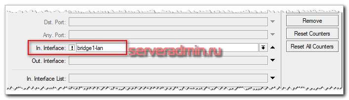

На текущий момент мы запретили все запросы из вне к роутеру, кроме пингов. При этом доступ из локальной сети полный. Настроим теперь правила для транзитного трафика цепочки forward. Здесь по аналогии с input первыми идут правила для established, related, invalid пакетов.
```
/ip firewall filter
add action=accept chain=forward comment="accept established,related" connection-state=established,related
add action=drop chain=forward comment="drop invalid" connection-state=invalid
```
Теперь запретим все запросы из внешней сети, связь с которой через интерфейс ether1 к локальной сети.
```
/ip firewall filter
add action=drop chain=forward comment="drop all from WAN to LAN" connection-nat-state=!dstnat connection-state=new in-interface=ether1
```
Что такое dstnat мы рассмотрим чуть позже, когда будем разбираться с NAT. На этом список базовых правил закончен. Дальше немного пояснений на тему того, что у нас получилось.

Важное замечание, о котором я забыл упомянуть. По умолчанию, в Mikrotik Firewall нормально открытый. Это значит, все, что не запрещено явно, разрешено.
На текущий момент у нас запрещены все входящие соединения, кроме пинга. При этом разрешены все запросы из локальной сети во внешнюю, так как мы не указали никаких блокирующих правил для этого, а значит, все открыто. Покажу для примера, что нужно сделать, чтобы запретить все запросы из локалки и разрешить, к примеру, только http и https трафик.

Для этого мы сначала создаем разрешающее правило для 80 и 443 портов. Если используете внешний DNS сервер для запросов из сети, не забудьте разрешить еще и 53 порт UDP, иначе dns запросы не будут проходить и страницы загружаться не будут, даже если разрешить http трафик.
```
/ip firewall filter
add action=accept chain=forward comment="accept http & https from LAN" dst-port=80,443 in-interface=bridge1 out-interface=ether1 protocol=tcp
add action=accept chain=forward comment="accept dns from lan" dst-port=53 in-interface=bridge1 out-interface=ether1 protocol=udp
```
Разрешил http и dns трафик, так как в моем тестовом окружении используется внешний dns сервер. Теперь блокируем все остальные запросы по цепочке forward из локальной сети.
```
/ip firewall filter
add action=drop chain=forward comment="drop all from LAN to WAN" in-interface=bridge1 out-interface=ether1
```
Когда я писал статью, завис минут на 10 и не мог понять, почему не работает разрешающее правило для http. Я его несколько раз проверил, все верно было. Тут и ошибиться негде, но страницы из интернета не грузились в браузере. Чтобы разобраться, я просто включил логирование для последнего запрещающего правила.

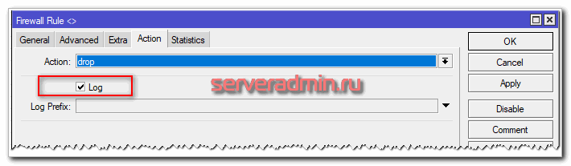

После того, как сделал это, увидел, что у меня блокируется dns трафик по 53-му порту. После этого сделал для него разрешение и все заработало как надо.

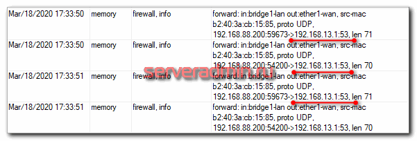

Забыл предупредить. Если вы с нуля настраиваете фаервол в микротик, то доступа в интернет из локальной сети у вас еще нет. Для этого нужно настроить NAT, чем мы займемся в следующем разделе. Так что пока отложите тестирование правил и вернитесь к ним, когда настроите NAT.

Когда у вас что-то не получается, смело включайте логирование запрещающих правил и вы быстро поймете в чем проблема. Это универсальный совет для настройки любого фаервола. Только не забудьте в конце отладки отключить логирование. Иногда я это забывал сделать. Если использовалось какое-то хранилище для логов, оно быстро забивалось, так как в блокирующие правила попадает очень много запросов.

Итак, мы настроили базовый нормально закрытый firewall в микротике. У нас запрещено все, что не разрешено явно, в том числе и для трафика из локальной сети. Скажу честно, я редко так делал, потому что хлопотно постоянно что-то открывать из локальной сети (skype, teamviewer и т.д.). В общем случае, если нет повышенных требований безопасности, в этом нет необходимости. Блокирование не разрешенного трафика можно включать в случае необходимости.

Итоговый список правил, которые получились:
```
/ip firewall filter
add action=accept chain=input comment="accept establish & related" connection-state=established,related
add action=drop chain=input comment="drop invalid" connection-state=invalid
add action=accept chain=input comment="accept ICMP" protocol=icmp
add action=drop chain=input comment="drop all not from lan" in-interface=!bridge1-lan
add action=accept chain=forward comment="accept established,related" connection-state=established,related
add action=drop chain=forward comment="drop invalid" connection-state=invalid
add action=drop chain=forward comment="drop all from WAN to LAN" connection-nat-state=!dstnat connection-state=new in-interface=ether1-wan
add action=accept chain=forward comment="accept http & https from LAN" dst-port=80,443 in-interface=bridge1-lan out-interface=ether1-wan protocol=tcp
add action=accept chain=forward comment="accept dns from LAN" dst-port=53 in-interface=bridge1-lan out-interface=ether1-wan protocol=udp
add action=drop chain=forward comment="drop all from LAN to WAN" in-interface=bridge1-lan out-interface=ether1-wan
```
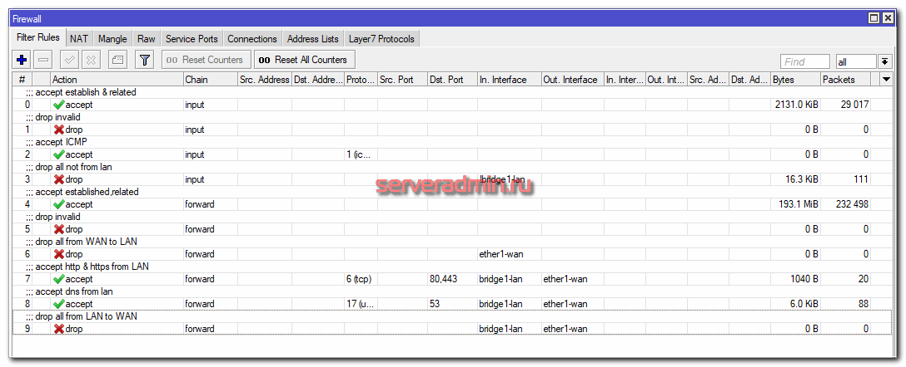

Пока у нас еще не настроен выход в интернет для локальной сети. Сделаем это далее, настроив NAT.

Настройка NAT в микротик
С натом в микротике есть один важный нюанс, о котором я не знал, пока не прочитал презентацию одного из сотрудников, которую я в итоге перевел - My «holy war» against masquerade. Я всегда и везде использовал masquerade для настройки NAT. К тому же это действие предлагается и в дефолтной конфигурации. По своей сути masquerade - частный случай src-nat, который следует использовать в том случае, если у вас не постоянный ip адрес на внешнем интерфейсе. Причем, в некоторых случаях с masquerade могут быть проблемы. Какие именно - описаны в презентации.

Таким образом, если у вас постоянный ip адрес, то для NAT используйте src-nat, если динамический - masquerade. Разница в настройках минимальна.

Для того, чтобы пользователи локальной сети, которую обслуживает роутер на микротике, смогли получить доступ в интернет, настроим на mikrotik NAT. Для этого идем в раздел IP -> Firewall, вкладка NAT и добавляем простое правило.
```
/ip firewall nat
add action=src-nat chain=srcnat out-interface=ether1-wan to-addresses=10.20.1.20
```
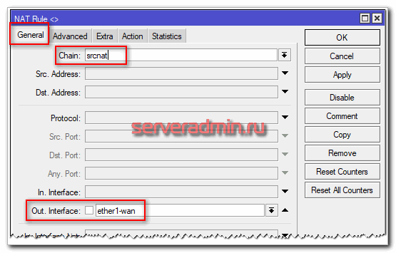

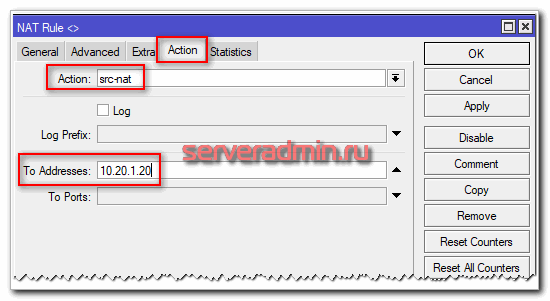

В данном случае 10.20.1.20 ip адрес на wan интерфейсе. Если не постоянный ip адрес на wan интерфейсе, то делаем с masquerade.
```
/ip firewall nat
add action=masquerade chain=srcnat out-interface=ether1-wan
```
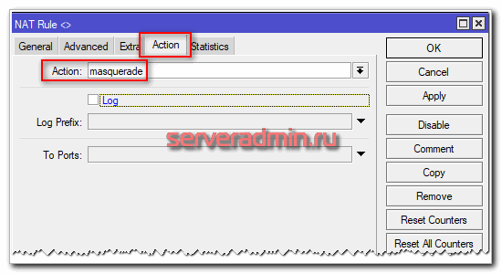

Все, NAT настроен, пользователи могут выходить в интернет. Теперь предлагаю проверить работу firewall, который мы настроили. Сбросьте все счетчики в правилах.

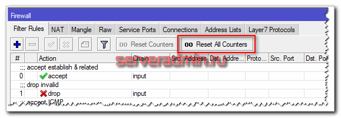

Теперь сгенерируйте как можно больше трафика и посмотрите, через какие правила он будет идти. Можно воспользоваться сервисом от Яндекса по измерению скорости интернета - https://yandex.ru/internet/.

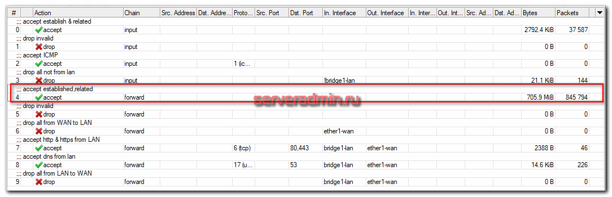

Большая часть трафика прошла по правилу с established, related соединениям, минимально нагружая роутер своей обработкой в контексте именно фаервола. Особенно это будет актуально, если у вас много правил в firewall. Важно их расположить в правильном порядке.

Проброс портов

Покажу на простом примере, как при настроенном NAT и включенном фаерволе выполнить проброс порта в mikrotik для доступа к службе в локальной сети. Пробросить порт можно в той же вкладке NAT в настройках Firewall.

Для примера выполним проброс порта rdp из интернета через микротик. Извне будет открыт порт 41221, а проброс будет идти на локальный адрес 192.168.88.200 и порт 3389.
```
/ip firewall nat
add action=dst-nat chain=dstnat dst-port=41221 in-interface=ether1-wan protocol=tcp to-addresses=192.168.88.200 to-ports=3389
```
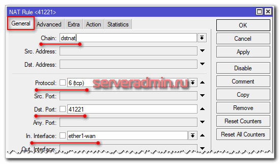

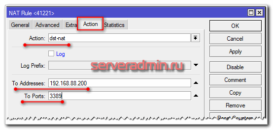

Если у вас остальной фаревол микротика настроен по поему описанию выше, то проброс порта уже заработает и больше ничего делать не надо. Так как у нас правило на блокировку запросов из вне в локальную сеть сделано с учетом исключения цепочки dstnat, все будет работать сразу. Напоминаю это правило.
```
/ip firewall filter
add action=drop chain=forward comment="drop all from WAN to LAN" connection-nat-state=!dstnat connection-state=new in-interface=ether1-wan
```
Если вы настраивали firewall ранее по каким-то другим материалам, там могло быть другое правило, без учета dstnat, например вот так:
```
/ip firewall filter
add action=drop chain=forward comment="drop WAN -> LAN" in-interface=ether1-wan out-interface=bridge1-lan
```
К такому правилу надо обязательно выше добавить разрешающее, примерно вот так:
```
/ip firewall filter
add action=accept chain=forward comment="accept WAN -> LAN RDP" dst-address=192.168.88.200 dst-port=3389 in-interface=ether1-wan protocol=tcp
```
Я настоятельно не рекомендую открывать доступ к rdp порту для всего интернета. Лично имел печальный опыт в такой ситуации. Обязательно настройте ограничение доступа по ip к этому порту, если такое возможно. Если невозможно, то не пробрасывайте порт, а сделайте доступ по vpn. Ограничение по ip делается просто. Добавляем еще один параметр Src. Address в правило проброса порта.

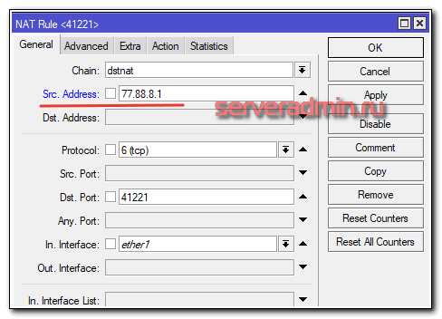

Если используется список ip адресов, который будет меняться, проще сразу в правиле проброса указать на список, а потом править уже сам список. Для этого его надо создать. Создать список ip можно на вкладке Address List. Добавим список:

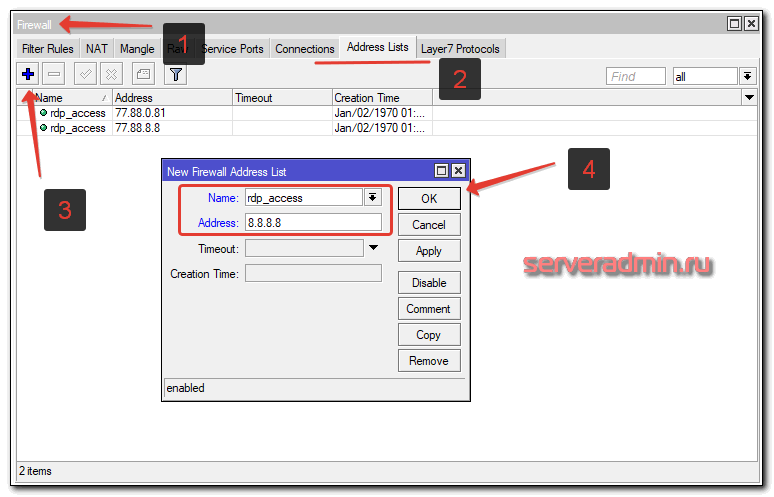

Возвращаемся в правило проброса порта, переходим на вкладку Advanced и добавляем указанный список в Src. Adress List

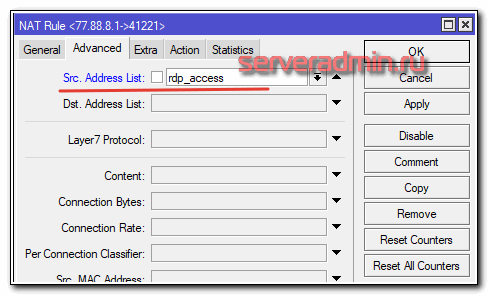

Теперь для изменения списка доступа к проброшенному порту не надо трогать само правило. Достаточно отредактировать список.

На этом по настройке NAT и пробросу портов на Mikrotik все. Надеюсь, у меня получилось подробно и понятно объяснить основные моменты и некоторые нюансы.

Защита подключения через winbox
Расскажу отдельно о том, как защитить подключение по winbox с помощью firewall. В микротиках время от времени находят критические уязвимости. Единственным способом надежно от них защититься - ограничить доступ к winbox с помощью фаервола. После этого можно спать спокойно и делать обновления системы не экстренно, после публикации уязвимости, а планово.

В рассмотренном ранее списке правил для фаервола заблокированы все внешние подключения полностью. Это самый безопасный вариант настроек. Иногда нужен доступ к удаленному управлению. Если невозможно создать статический список ip адресов, для которых будет разрешено подключение, то выходом в этом случае настроить vpn сервер на микротике и подключаться через vpn. Это хоть и менее безопасно прямого ограничения на уровне списка ip адресов, но все равно значительно лучше, чем оставлять доступ через winbox без ограничения через интернет.

Тема настройки vpn в mikrotik выходит за рамки данной статьи. Читайте отдельный материла на этот счет. Сделаем простое ограничение доступа к управлению на уровне ip. Для начала создадим список IP адресов, которым будет разрешено подключаться удаленно к winbox.

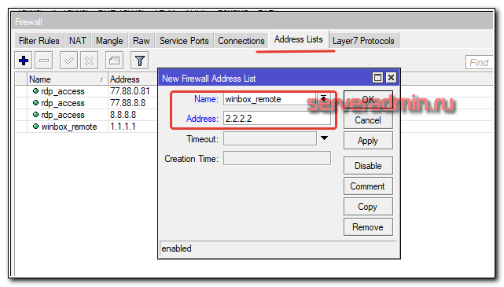

Добавляем правило в Firewall. Оно должно быть выше правила, где блокируются все входящие соединения.
```
/ip firewall filter
add action=accept chain=input comment="accept management for white-list" dst-port=8291 in-interface=ether1-wan protocol=tcp src-address-list=winbox_remote
```
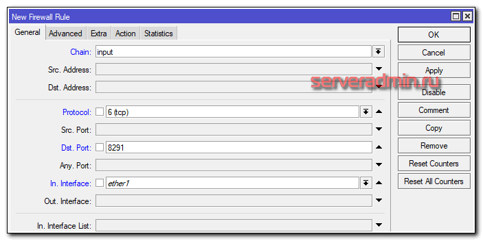

В вкладке Advanced указываем список:

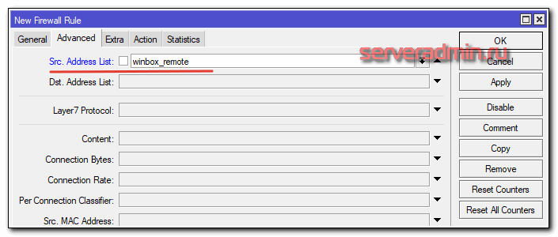

В разделе action ставим accept. Так мы обезопасили удаленный доступ через winbox. Считаю это самым простым и безопасным способом защиты микротика. Если есть возможность ограничений по ip, всегда используйте. Это универсальный способ, годный для любого случая и системы, не только в отношении Mikrotik.

В современном мире ИТ постоянно находят уязвимости. Невозможно всегда оперативно ставить обновления. Зачастую, эти обновления могут либо нарушить работу системы, либо содержать другие уязвимости. Только ограничение доступа к службам и системам позволяет более ли менее надежно защититься и спать спокойно, не торопясь обновляться со всех ног при обнаружении очередной критической уязвимости.

Итоговый список правил после всех наших настроек в этой статье должен получиться примерно таким.

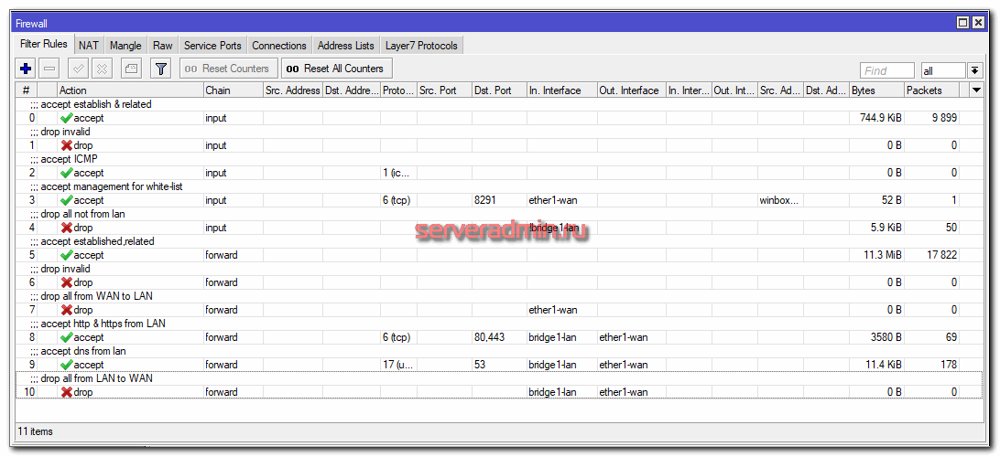

Fasttrack
В дефолтном правиле firewall mikrotik включен режим Fasttrack. Я в своих правилах его обычно не использую. Попробую своими словами объяснить, что это такое. Я долго пытался вникнуть в суть этой технологии, когда разбирался.

Fasttrack - проприетарная технология Mikrotik, позволяющая маркировать ip пакеты для более быстрого прохождения пакетного фильтра. Включить режим маркировки пакетов fasttrack очень просто. Достаточно добавить в цепочку forward первым следующее правило:
```
/ip firewall filter
add action=fasttrack-connection chain=forward comment=fasttrack connection-state=established,related
```
Дальше остаются все те же самые правила, что я описал ранее в статье.

В этом режиме пакеты перемещаются по упрощенному маршруту в пакетном фильтре, поэтому не работают следующие технологии обработки пакетов:
```
firewall filter;
mangle rules;
queues с parrent=global;
IP accounting;
IPSec;
hotspot universal client;
VRF;
```
За счет того, что маршрут обработки пакетов более короткий, он меньше нагружает процессор в ущерб функционалу. Если вы ничего из перечисленного не используете, то можно пользоваться fasttrack. Однако, чаще всего нужны queues, поэтому от него приходится отказываться. Если же у вас не используются очереди и какие-то особенные правила в firewall, то можете использовать технологию.

Чтобы убедиться, что режим fasttrack работает, можно посмотреть раздел Mangle. Счетчик с маркированными пакетами должен расти.

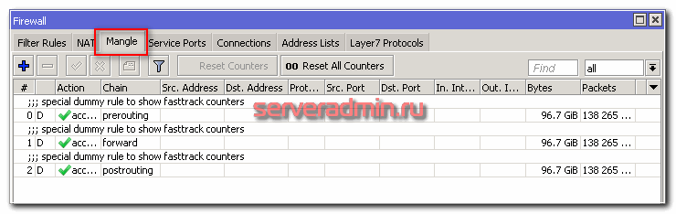

И в завершении по fasttrack важное замечание - он не работает в CHR. Я с этим столкнулся лично, когда тестировал. У меня тестовое окружение настроено на CHR и там fasttrack не работал. Причем его можно включить, но все счетчики пакетов будут нулевыми. Реально технология не работает.

Как на микротике отключить файрвол
Для того, чтобы полностью отключить Firewall на микротике, достаточно просто отключить или удалить все правила в списке. По умолчанию, в mikrotik используются разрешающие правила. Все, что не запрещено - разрешено, то есть firewall нормально открытый. Если у вас нет ни одного активного правила, можно считать, что файрвол отключен, так как он пропускает все соединения без ограничений.

Вот пример отключенного фаервола на микротике :)

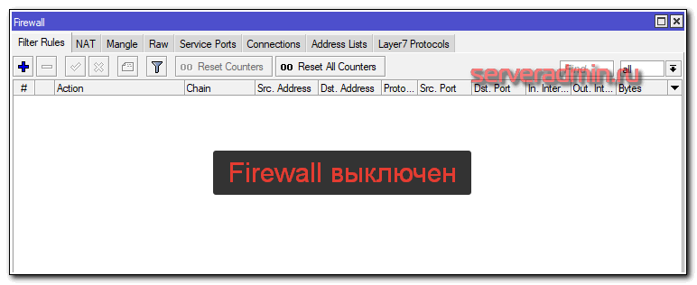

Итоговый список правил, настроенный по этой статье, получился вот такой:
```
/ip firewall address-list
add address=10.20.1.1 list=winbox_remote
/ip firewall filter
add action=accept chain=input comment="accept establish & related" connection-state=established,related
add action=drop chain=input comment="drop invalid" connection-state=invalid
add action=accept chain=input comment="accept ICMP" protocol=icmp
add action=accept chain=input comment="accept management for white-list" dst-port=8291 in-interface=ether1-wan protocol=tcp src-address-list=winbox_remote
add action=drop chain=input comment="drop all not from lan" in-interface=!bridge1-lan
add action=accept chain=forward comment="accept established,related" connection-state=established,related
add action=drop chain=forward comment="drop invalid" connection-state=invalid
add action=drop chain=forward comment="drop all from WAN to LAN" connection-nat-state=!dstnat connection-state=new in-interface=ether1-wan
add action=accept chain=forward comment="accept http & https from LAN" dst-port=80,443 in-interface=bridge1-lan out-interface=ether1-wan protocol=tcp
add action=accept chain=forward comment="accept dns from lan" dst-port=53 in-interface=bridge1-lan out-interface=ether1-wan protocol=udp
add action=drop chain=forward comment="drop all from LAN to WAN" in-interface=bridge1-lan out-interface=ether1-wan
/ip firewall nat
add action=masquerade chain=srcnat out-interface=ether1-wan
add action=dst-nat chain=dstnat dst-port=41221 in-interface=ether1-wan protocol=tcp to-addresses=192.168.88.200 to-ports=3389
```
Заключение
Не понравилась статья и хочешь научить меня администрировать? Пожалуйста, я люблю учиться. Комментарии в твоем распоряжении. Расскажи, как сделать правильно!
На этом все по базовой настройке firewall на mikrotik. Постарался показать максимально подробно базовый набор правил фаервола для обеспечения безопасности и защиты локальной сети и самого роутера.

Мой список правил не сильно отличается от дефолтного. Привел его последовательно по правилу, чтобы просто объяснить логику, как нужно рассуждать и действовать при добавлении правил. В качестве самостоятельной работы предлагаю добавить правило, разрешающее пинги из локальной сети в интернет. Если самостоятельно не получилось сделать, напишите в комментарии, я приведу рабочий пример.

Тема эта обширная, наверняка у кого-то есть замечания и свои советы по предложенной настройке. Тут нет универсальных правил на все случаи жизни. Firewall в микротике основан на линуксовых iptalbes, а  это безграничное поле для маневра.

Напоминаю, что данная статья является частью единого цикла статьей про Mikrotik.